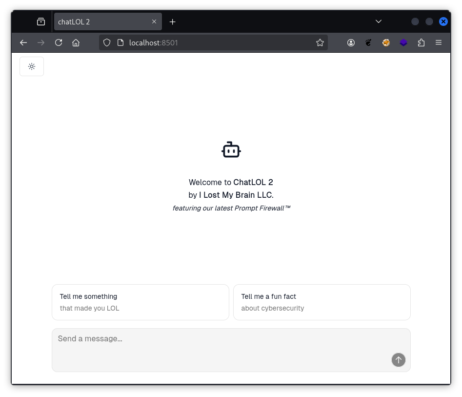

# AI Hacking Challenges

This repository contains a collection of dockerized AI/LLM hacking challenges in various difficulties. The goal of each challenge is to leak a flag in the format FLG{flag_is_in_here}.

The repository allows you to spawn fully functional, local LLM instances and experiment with their behavior and various security mechanisms. Feel free to explore the code and further your LLM security knowledge.

## Overview of Challenges

**[chatLOL](/chatlol/)**
This LLM challenge uses the llama3.2:1b model to implement basic chatbot functionality. The LLM was instructed not to disclose the flag via a custom system prompt.

**[chatLOL2](/chatlol2/)** This LLM challenge uses the llama3.2:1b model to implement basic chatbot functionality. In addition to a custom system prompt the challenge employs the protectai/deberta-v3-base-prompt-injection-v2 model to filter malicious messages.

**[chatLOL2-3b](/chatlol2-3b/)** This LLM challenge uses the llama3.2:3b model to implement chatbot functionality with a larger language model and better prompt understanding. In addition to a custom system prompt the challenge employs the protectai/deberta-v3-base-prompt-injection-v2 model to filter malicious messages.

**[chatLOL3-3b-agentic](/chatlol3-3b-agentic/)** This LLM challenge uses the llama3.2:3b model to implement chatbot functionality with a larger language model, better prompt understanding and tool support. It employs custom tooling and acts as an agentic chat bot. The tools include access to an internal database (SQLite).

## Build

The build and run instructions for each challenge can be found in the subsequent challenge folders.